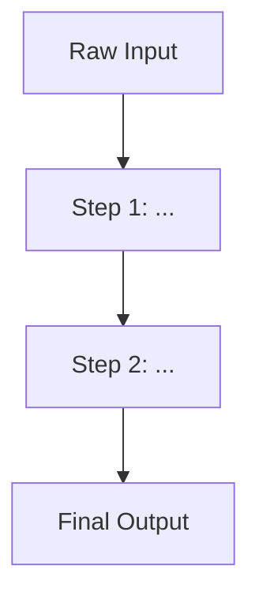
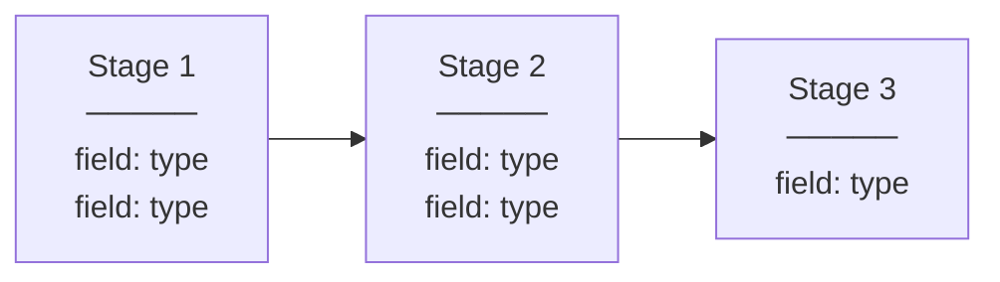

# Artifact Template Reference
> Generic envelope + content templates for all 17 application skill artifacts.

---

## Generic Envelope (YAML Frontmatter)

Every artifact file uses this frontmatter. The content sections below it vary by type.

```yaml
---
name: [readable name of this artifact]
artifact_type: [see types list below]
skill: [vcm | de | tdd | ga]
project: [project name]
purpose: [one-line description — what this artifact captures]
version: 1
status: draft
date: [YYYY-MM-DD]
source: [who provided the information]
step: [step name — only if this artifact is linked to a specific step]
linked_artifacts: [filenames of related artifacts — add as connections emerge]
---
```

**Status values:**
- `draft` — high-level intention captured, sections sparse
- `detailed` — deeper content filled in through conversation
- `confirmed` — validated by stakeholder or downstream skill, ready for use

**Artifact types:**

| Skill | Types |
|-------|-------|
| VCM | value-chain-map, step-spec, stakeholder-register, gap-log |
| DE | evolution-diagram, state-diagram, evolution-table, transformation-audit, schema-derivation |
| TDD | golden-example-set, test-spec, eval-rubric |
| GA | steps-table, edge-functions, skills-config, static-messages, orchestrator-design |

---

## VCM: Value Chain Map

```yaml
---
name: [process name]
artifact_type: value-chain-map
skill: vcm
project: [project name]
purpose: Ordered steps from first input to final output
version: 1
status: draft
date: [YYYY-MM-DD]
source: [who provided the information]
linked_artifacts: []
---
```

### Process

[One-sentence purpose]

### Steps

| # | Step | Intention | Input | Output | Status |
|---|------|-----------|-------|--------|--------|
| 1 | [name] | [what it achieves] | [what it receives] | [what it produces] | [mapped/detailed/confirmed] |

### Data Evolution

[First input] → Step 1 → [intermediate] → Step 2 → ... → [final output]

---

## VCM: Step Specification

```yaml
---
name: [step name]
artifact_type: step-spec
skill: vcm
project: [project name]
purpose: Intention, I/O, and completion criteria for one step
version: 1
status: draft
date: [YYYY-MM-DD]
source: [who provided the information]
step: [step name]
linked_artifacts: []
---
```

### Intention

[What this step is trying to achieve and why it exists]

### Input

- [What it receives, in what form, from where]

### Output

- [What it produces, in what form, for whom]

### Completion Criteria

- [How you know it's done — good result vs bad result]

### Love

- [What works well about this today]

### Hate

- [What's painful, slow, broken, frustrating]

### Open Questions

- [Anything still unclear — links to gap log]

---

## VCM: Stakeholder Register

```yaml
---
name: Stakeholder Register
artifact_type: stakeholder-register
skill: vcm
project: [project name]
purpose: Who informed what, who to talk to next
version: 1
status: draft
date: [YYYY-MM-DD]
source: [interview sessions]
linked_artifacts: []
---
```

### Register

| Name | Role | Interviewed | Informed Steps | Gaps Identified | Follow-up With |
|------|------|-------------|----------------|-----------------|----------------|
| [name] | [role] | [date or pending] | [step numbers] | [what they couldn't answer] | [who they suggested] |

---

## VCM: Gap Log

```yaml
---
name: Gap Log
artifact_type: gap-log
skill: vcm
project: [project name]
purpose: What's unknown — drives the next session
version: 1
status: draft
date: [YYYY-MM-DD]
source: [interview sessions]
linked_artifacts: []
---
```

### Gaps

Open: [count] | Closed: [count]

| # | Gap | Identified By | Step | Status | Resolution |
|---|-----|---------------|------|--------|------------|
| 1 | [what's unknown] | [stakeholder] | [step #] | [open/closed/design decision] | [how resolved, or who to ask] |

---

## DE: Data Evolution Diagram

```yaml
---
name: [process name] — Evolution Diagram
artifact_type: evolution-diagram
skill: de
project: [project name]
purpose: Visual flow of data transformations from input to output
version: 1
status: draft
date: [YYYY-MM-DD]
source: [derived from step specifications]
linked_artifacts: []
---
```

### Diagram



---

## DE: Data State Diagram

```yaml
---
name: [process name] — State Diagram
artifact_type: state-diagram
skill: de
project: [project name]
purpose: What the data looks like at each stage — fields, types, structure
version: 1
status: draft
date: [YYYY-MM-DD]
source: [derived from step specifications]
linked_artifacts: []
---
```

### Diagram



---

## DE: Data Evolution Table

```yaml
---
name: [process name] — Evolution Table
artifact_type: evolution-table
skill: de
project: [project name]
purpose: Field-level lineage — source, form, and consumer for every field
version: 1
status: draft
date: [YYYY-MM-DD]
source: [derived from step specifications and domain knowledge]
linked_artifacts: []
---
```

### Stage 1: [name]

| Field | Form | Source | Becomes |
|-------|------|--------|---------|
| [field name] | [type/format] | [where it comes from] | [what stage consumes it] |

### Stage 2: [name]

| Field | Form | Derived From | Used By |
|-------|------|-------------|---------|
| [field name] | [type/format] | [which stage/field] | [what consumes it] |

---

## DE: Transformation Audit

```yaml
---
name: [process name] — Transformation Audit
artifact_type: transformation-audit
skill: de
project: [project name]
purpose: Question each transformation — necessary, efficient, right format?
version: 1
status: draft
date: [YYYY-MM-DD]
source: [derived from evolution table]
linked_artifacts: []
---
```

### Audit

| Stage | What Changes | Why | Necessary? | Issue | Action |
|-------|-------------|-----|------------|-------|--------|
| [#] | [transformation] | [purpose] | [yes/waste/unclear] | [if any] | [keep/remove/redesign/escalate] |

---

## DE: Schema Derivation

```yaml
---
name: [process name] — Schema Derivation
artifact_type: schema-derivation
skill: de
project: [project name]
purpose: Tables and columns that emerge from the data flow
version: 1
status: draft
date: [YYYY-MM-DD]
source: [derived from evolution table and transformation audit]
linked_artifacts: []
---
```

### Table: [name]

| Column | Type | From Stage | Purpose |
|--------|------|-----------|---------|
| [name] | [type] | [stage #] | [why this column exists] |

---

## TDD: Golden Example Set

```yaml
---
name: [function name] — Golden Examples
artifact_type: golden-example-set
skill: tdd
project: [project name]
purpose: Concrete input + evaluation criteria for one function
version: 1
status: draft
date: [YYYY-MM-DD]
source: [derived from step specification]
step: [step name]
linked_artifacts: []
---
```

### Function

- **Type:** [pure code | code+LLM | sub-agent]

### Example 1: [descriptive name]

**Input:**
[Concrete input data — real or realistic]

**Expected Output Characteristics:**
- [What must be TRUE about the output]
- [What must be PRESENT]
- [What must NOT be present]

**Evaluation Criteria:**

| Criterion | Type | Required |
|-----------|------|----------|
| [criterion] | [completeness/faithfulness/structure/validity] | [yes/no] |

**Edge Cases:**

| Variant | Input Modification | Expected Behaviour |
|---------|-------------------|-------------------|
| Missing data | [what's removed] | [expected handling] |
| Ambiguous input | [what's conflicting] | [expected handling] |

---

## TDD: Test Specification

```yaml
---
name: [step name] — Test Spec
artifact_type: test-spec
skill: tdd
project: [project name]
purpose: How to run and evaluate one function's golden examples
version: 1
status: draft
date: [YYYY-MM-DD]
source: [derived from golden example set]
step: [step name]
linked_artifacts: []
---
```

### What Is Being Tested

[One sentence — the function's intention]

### Pass Criteria

- All "required" evaluation criteria must be met
- [Threshold if applicable]
- Edge cases must produce graceful handling, not crashes or fabrication

### How to Run

- [Isolated — no dependency on other steps]
- [Input: from golden example, not live data]
- [Output: captured and stored for evaluation]

### Dependencies

- [Skill config required]
- [Prompt template required]
- [Test data source]

---

## TDD: Evaluation Rubric

```yaml
---
name: [function name] — Evaluation Rubric
artifact_type: eval-rubric
skill: tdd
project: [project name]
purpose: How to judge code+LLM output — criterion, weight, pass/fail
version: 1
status: draft
date: [YYYY-MM-DD]
source: [derived from golden example set]
step: [step name]
linked_artifacts: []
---
```

### Rubric

| Criterion | Weight | Pass | Fail |
|-----------|--------|------|------|
| [criterion] | [required/optional] | [what pass looks like] | [what fail looks like] |

---

## GA: Steps Table

```yaml
---
name: [process name] — Steps Table
artifact_type: steps-table
skill: ga
project: [project name]
purpose: Ordered process with prerequisites and function types
version: 1
status: draft
date: [YYYY-MM-DD]
source: [derived from value chain map]
linked_artifacts: []
---
```

### Steps

| # | Step | Visible | Prerequisites | Completion Criteria | Function Ref | Message Ref |
|---|------|---------|---------------|--------------------|--------------|-----------  |
| 1 | [name] | [yes/no] | [step #s or none] | [what "done" means] | [function name] | [message key] |

---

## GA: Edge Functions

```yaml
---
name: [process name] — Edge Functions
artifact_type: edge-functions
skill: ga
project: [project name]
purpose: Typed executable units with I/O schemas
version: 1
status: draft
date: [YYYY-MM-DD]
source: [derived from step specifications and golden examples]
linked_artifacts: []
---
```

### Functions

| Function | Type | Input Schema | Output Schema | Linked Skill | Testable |
|----------|------|-------------|---------------|-------------|----------|
| [name] | [code/code+LLM/sub-agent] | [schema ref] | [schema ref] | [skill name or none] | [yes/no] |

---

## GA: Skills Config

```yaml
---
name: [process name] — Skills Config
artifact_type: skills-config
skill: ga
project: [project name]
purpose: Methodology loaded at runtime — swappable, standard structure
version: 1
status: draft
date: [YYYY-MM-DD]
source: [derived from evaluation rubrics and domain frameworks]
linked_artifacts: []
---
```

### Skills

| Skill | Framework | Dimensions | Rubric Ref |
|-------|-----------|-----------|------------|
| [name] | [source methodology] | [what it measures] | [eval rubric filename] |

---

## GA: Static Messages

```yaml
---
name: [process name] — Static Messages
artifact_type: static-messages
skill: ga
project: [project name]
purpose: All user-facing text — configurable, zero hardcoded strings
version: 1
status: draft
date: [YYYY-MM-DD]
source: [derived from step specifications]
linked_artifacts: []
---
```

### Messages

| Key | Step | Message | Language |
|-----|------|---------|----------|
| [key] | [step #] | [user-facing text] | [en/de/etc] |

---

## GA: Orchestrator Design

```yaml
---
name: [process name] — Orchestrator Design
artifact_type: orchestrator-design
skill: ga
project: [project name]
purpose: State machine loop — how the application coordinates execution
version: 1
status: draft
date: [YYYY-MM-DD]
source: [derived from all upstream artifacts]
linked_artifacts: []
---
```

### Loop

1. Get/create session
2. Persist user message to chat transcript
3. Load current step
4. If invisible → auto-execute → store → advance → repeat
5. If visible → load message + function + skill + data + files + history
   → assemble dynamic prompt → single stateless LLM call
   → parse response → store input + output + audit
   → if complete → advance | else → stay

### Dynamic Prompt Assembly

1. Runtime identity
2. Current step
3. Static message
4. Function logic
5. Skill config
6. Step data
7. Bucket files
8. Chat transcript
9. Expected output schema

### Design Decisions

- [Key architectural decisions for this specific application]
