# Data Evolution

Understand what you're building by seeing how your data evolves. The value chain map describes the logical steps — this skill describes what happens to the actual data. Every field, every transformation, every enrichment — visualized so you can see the full picture, question each transformation, and design the right structures.

Steps are the canonical sequence. Data evolution is the deeper question: what am I asking for, why, and how does it transform into the output I need?

---

## How This Skill Works

### 1. Start from What You Know

This skill can run alongside or after the Value Chain Mapping skill. It doesn't require a complete step sequence — start with whatever you know about the data.

**Example — a candidate interview system:**
- "I know I'll have a CV and a job description"
- "At some point we break the job description into structured requirements"
- "The CV evidence gets attached to each requirement"

That's enough to start mapping the evolution. The same approach works for any domain — start with the raw inputs you know about and trace where they go.

### 2. Trace the Data, Not the Steps

For each piece of data in the system, follow its journey:
- Where does it enter? (raw form — a file, a text input, an API response)
- What happens to it? (parsed, split, restructured, combined, enriched)
- What does it become? (structured fields, scored datasets, final outputs)
- Why does each transformation exist? (what would break if we skipped it)

### 3. Visualize the Evolution

Produce diagrams that show how data flows and transforms. Use Mermaid for flow diagrams and markdown tables for field-level detail. The visuals are the primary output — they're how you understand, discuss, and validate the design.

### 4. Question Every Transformation

At each point where data changes shape:
- Is this the right structure for what comes next?
- Is this transformation necessary or is it waste?
- Is anything lost that a later step needs?
- Could two transformations be combined?
- Should we go back to the value chain map and rethink this step?

### 5. Let the Schema Emerge

Don't design the database first. Let the data evolution tell you what tables you need, what columns, what relationships. The schema is a consequence of how data needs to flow — not the other way around.

---

## Visualizing Data Evolution

### Mermaid Flow Diagram

The primary visual. Shows how data transforms from raw input to final output. Example from a candidate interview system:


### Mermaid Data State Diagram

Shows what the data LOOKS LIKE at each stage — not what happens, but what EXISTS. Same example:

```mermaid
graph LR
    S1["Stage 1<br/>─────────<br/>cv_file: PDF<br/>jd_text: string"] 
    --> S2["Stage 2<br/>─────────<br/>cv_file: PDF<br/>jd_requirements: array<br/>├ title: string<br/>├ required: bool<br/>└ keywords: array"]
    --> S3["Stage 3<br/>─────────<br/>cv_file: PDF<br/>cv_parsed: object<br/>├ experience: array<br/>├ skills: array<br/>└ education: array<br/>jd_requirements: array"]
    --> S4["Stage 4<br/>─────────<br/>matches: array<br/>├ requirement: ref<br/>├ evidence: text[ ]<br/>└ source: enum"]
    --> S5["Stage 5<br/>─────────<br/>assessment: object<br/>├ matches: array<br/>├ scores: array<br/>├ evidence: array<br/>└ overall: score"]
```



### Markdown Data Evolution Table

Field-level detail for each stage. Same example, showing the template with real field names:

```markdown
# Data Evolution Map
# Version: [N] | Last updated: [date]

## Stage 1: [name] — Raw Input
| Field | Form | Source | Becomes |
|-------|------|--------|---------|
| cv_file | PDF binary | user upload | parsed in Stage 3 |
| jd_text | free text | user input | structured in Stage 2 |

## Stage 2: [name] — JD Structured
| Field | Form | Derived From | Used By |
|-------|------|-------------|---------|
| jd_requirements[] | structured array | jd_text (Stage 1) | matching in Stage 4 |
| jd_requirements[].title | string | extracted from jd_text | display + matching |
| jd_requirements[].required | boolean | inferred from jd_text | prioritization |

## [Continue for each stage...]
```

---

## The Drill-Down: Field Level

When you need to understand a specific field deeply — where it comes from, where it goes, why it exists.

```markdown
# Field: [name]
# Entity: [what it belongs to]

## Journey
1. **Captured** at [stage] from [source] as [format]
2. **Transformed** at [stage] — [what changed and why]
3. **Combined** at [stage] with [other fields] to produce [result]
4. **Consumed** at [stage] by [function] for [purpose]

## Questions
- Is this the right format at each stage?
- Could any transformation be skipped?
- Is anything lost between stages?
```

---

## Artifacts

### 1. Data Evolution Diagram (Mermaid)

The visual flow showing transformations. Primary output — this is what you discuss, print, and validate.

### 2. Data State Diagram (Mermaid)

What the data looks like at each stage — the fields, types, and structure. Shows the shape of the data, not the process.

### 3. Data Evolution Table (Markdown)

Field-level detail per stage. Captures: field name, form, source/derived from, and what consumes it.

### 4. Transformation Audit

Questions about each transformation — necessary, efficient, right format, waste?

```markdown
# Transformation Audit
# Version: [N]

| Stage | What Changes | Why | Necessary? | Issue | Action |
|-------|-------------|-----|------------|-------|--------|
| [#] | [transformation] | [purpose] | [yes/waste/unclear] | [if any] | [keep/remove/redesign/escalate] |
```

### 5. Schema Derivation (when ready)

Once the evolution is stable, the schema falls out naturally. Not an upfront design — a consequence.

```markdown
# Schema Derivation
# Derived from: Data Evolution Map v[N]

## Table: [name]
| Column | Type | From Stage | Purpose |
|--------|------|-----------|---------|
| [name] | [type] | [stage #] | [why this column exists] |
```

---

## Side Benefits

When you have field-level data evolution mapped, you naturally gain visibility into:

- **GDPR**: You know what personal data you have, where it is, and how to delete it
- **Row Level Security**: You know who owns each field and who should access it
- **EU AI Act**: You know which fields feed AI decisions and can trace the reasoning
- **Auditability**: You can reconstruct any output from its inputs

These aren't the reason for the skill — they're what you get for free when you understand your data at this level.

---

## Anti-Patterns

| Mistake | Why It Fails | Fix |
|---------|-------------|-----|
| Designing the schema before understanding data evolution | Schema serves assumptions, not actual data flow — rework later | Map the evolution first, let the schema emerge from it |
| Staying at step level instead of field level | "Step 3 processes the CV" tells you nothing about what fields exist or how they transform | Trace individual fields: what enters, what changes, what comes out |
| No diagram — only text descriptions | Hard to see the full picture, hard to discuss, hard to spot waste | Mermaid diagrams are the primary output — visual first |
| Skipping "why does this transformation exist?" | Unnecessary transformations accumulate — waste, complexity, bugs | Every transformation must justify its existence |
| Designing data structures in isolation from the flow | Fields that no step produces or consumes — orphaned, confusing | Every field has a producer and a consumer in the evolution |
| Premature optimization of data formats | Restructuring before you understand the full flow — rework | Map the full evolution first, then optimize |

---

## Validation Checklist

Before considering the data evolution understood:

- [ ] Diagram produced showing data flow from first input to final output?
- [ ] Data state visible at each stage — what fields exist, what form?
- [ ] Every field traced: where captured, how transformed, what consumes it?
- [ ] Every transformation questioned: necessary, efficient, right format?
- [ ] Schema derived from the evolution, not assumed upfront?
- [ ] No orphaned fields — everything has a producer and a consumer?
- [ ] Feedback sent to value chain map where transformations don't make sense?
- [ ] Visuals are clear enough to discuss with stakeholders?

---

## Artifact Governance

When creating artifacts from this skill:

1. Use the templates in `.claude/skills/artifact-template.md` — copy the relevant section (evolution-diagram, state-diagram, evolution-table, transformation-audit, or schema-derivation)
2. Fill in the YAML frontmatter with project, version, status, and source
3. Register the artifact in `DESIGN.md` (project root) — add a row to the Artifact Registry table

---

## Referenced Skills

| Skill | Relationship |
|-------|-------------|
| **Value Chain Mapping** | Peer — provides the step sequence; data evolution provides the field-level depth |
| **TDD Golden Examples** | Peer — fields that are transformed need golden examples for the transformation |
| **Governed Architecture** | Downstream — consumes the schema derivation and data flow design |
| **Configure Claude Code** | Foundation — the development environment where everything is implemented |

---

*See the data. Trace the journey. Question every transformation. Let the schema emerge.*
